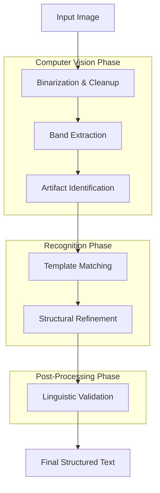

# HOW IT WORKS: The Textify Engine

Textify is a structural OCR engine designed specifically for **clean digital text**. Unlike traditional OCR which handles noisy scanned documents, Textify optimizes for the pixel-perfect reliability of computer-generated text (PDFs, screenshots, UI captures).

---

## High-Level Pipeline

---

## Phase 1: Computer Vision Extraction

### 1. Pixel Preparation (The Digital Assumption)
Because we target computer-generated text, we assume higher structural reliability.
- **Otsu's Thresholding**: We create a high-contrast black-and-white mask, separating foreground text from the background.
- **Decorative Line Removal**: We identify and strip non-text elements like horizontal separators or border lines that could interfere with extraction.

### 2. Band & Artifact Extraction
- **Horizontal Projection**: The engine "slices" the image into horizontal **Bands** (text lines) by looking for continuous white-space valleys.
- **Connected Components**: Within each band, we find individual "Artifacts" (blobs of pixels).
- **Merge Logic**: We automatically join multi-part glyphs (like `i`, `j`, `:`, `=`, `!`, `%`) based on their vertical alignment and proximity.
- **Space Identification**: We track the "kerning" between artifacts. Gaps significantly wider than the average are marked as `space` characters.

---

## Phase 2: Recognition & Recognition

### 3. Template Matching Strategy
Instead of heavy neural networks, we use a high-performance **structural matching** approach:
- **Histogram Pre-Ranking**: To save time, we first compare the row/column pixel counts (histograms) of an artifact against our library.
- **Hamming Distance**: We perform a bitwise comparison (Hamming distance) on the top-15 candidates identified by the histogram.
- **Tie-Breaking**: If scores are close, we use structural features (number of enclosures, vertical stems, lower-right strokes) to pick the winner (e.g., disambiguating `B` vs `D` or `P` vs `R`).

### 4. Dynamic Splitting & Merging
- **Touching Characters**: If a match score is low and the artifact is wide, we attempt to split it at "valleys" (vertical gaps) and re-match the pieces.
- **Fragment Merging**: If two narrow artifacts look like they belong together (e.g., a split `W`), we tentatively merge them and check if the combined score improves.

---

## Phase 3: Linguistic Post-Processing

### 5. Dictionary-Based Safety Auditor
When `applyDictionary` is enabled, the engine uses a dictionary as a **safety auditor**, not a blind corrector. We follow strict rules to avoid "hallucinating" words:
- **Digit Immunity**: Any token containing numbers (prices, dates, IDs) is **never** touched by the dictionary.
- **Strict Distance**: We only correct a word if the suggestion is the **exact same length** and has a Levenshtein distance of **1** (a single-character fix).
- **Confusion Groups**: We only allow swaps for structurally similar characters (like `1` vs `l` or `0` vs `O`).

### 6. Casing & Formatting Guardrails
- **Case Preservation**: We never force whole-line normalization. Acronyms and mixed-case words are preserved as detected.
- **Contextual Alignment**: If the dictionary fixes a word, it inherits the casing of the original OCR result (e.g., `AppIe` → `Apple`).

---

## Core Design Principles

| Principle | Description |
| :--- | :--- |
| **Structure > Language** | If the pixels look like a letter, that's more important than the dictionary's opinion. |
| **No Placeholders** | We don't guess. If we can't find a high-confidence match, we return the raw structural reading. |
| **Speed & Precision** | By assuming a clean background, we avoid heavy noise-reduction steps, making the engine extremely fast. |
| **Digital-First** | No skew correction or handwriting support. This focus allows for near 100% accuracy on digital sources. |
