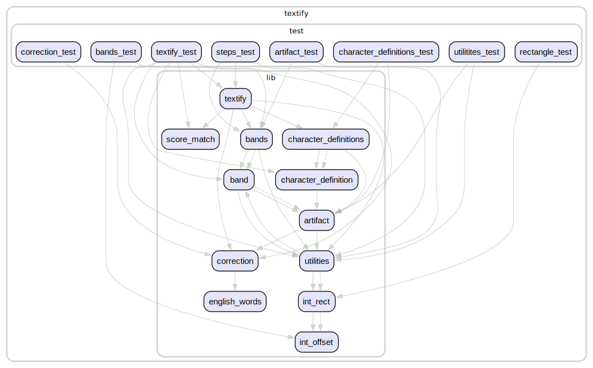

# TEXTify

A pure Dart/Flutter OCR library for extracting text from clean digital images.

✅ **100% offline** - No internet or cloud services required
✅ **Cross-platform** - Works on Android, iOS, macOS, Windows, Linux, and Web
✅ **Lightweight** - No external dependencies, just pure Dart code
✅ **Privacy-focused** - All processing happens on-device

## Why TEXTify?

Unlike traditional OCR solutions that are:

- **Heavy** (require C/C++ compilation, external dependencies)
- **Complex** (difficult cross-platform setup)
- **Cloud-dependent** (require internet, privacy concerns)
- **Platform-limited** (don't work everywhere)

TEXTify provides a **simple, lightweight alternative** that just works.

## Installation

Add this to your package's `pubspec.yaml` file:

```yaml
dependencies:
  textify:
```

Then run:

```bash
flutter pub get
```

## How to use

Here is an example of how to use TEXTify:

``` dart
import 'package:textify/textify.dart';

// Load your image (example using flutter's rootBundle)
final ByteData imageData = await rootBundle.load('assets/scan.png');
final ui.Codec codec = await ui.instantiateImageCodec(imageData.buffer.asUint8List());
final ui.FrameInfo frameInfo = await codec.getNextFrame();
final ui.Image inputImage = frameInfo.image;

// Instantiate TEXTify once with configuration
final textify = Textify(
  config: TextifyConfig(
    applyDictionaryCorrection: true, // Enable dictionary correction
  ),
);
await textify.init();

// Extract text from the image
final String extractedText = await textify.getTextFromImage(image: inputImage);

print(extractedText);
```

## Configuration

TEXTify provides extensive configuration options to customize OCR behavior for different use cases:

### Basic Configuration

```dart
import 'package:textify/textify.dart';

// Create Textify instance with custom configuration
final textify = Textify(
  config: TextifyConfig(
    dilationSize: 25,           // Controls pixel merging (higher = more merging)
    excludeLongLines: true,     // Ignore long horizontal/vertical lines
    attemptCharacterSplitting: true,  // Try to separate touching characters
    applyDictionaryCorrection: false, // Use dictionary for better accuracy
    matchingThreshold: 0.4,     // Minimum match confidence (0.0-1.0)
    maxProcessingTimeMs: 30000, // Maximum processing time
  ),
);

// Initialize and use
await textify.init();
final text = await textify.getTextFromImage(image: inputImage);
```

### Preset Configurations

TEXTify includes optimized presets for common scenarios:

```dart
// Fast processing (lower accuracy, quicker results)
final fastTextify = Textify(config: TextifyConfig.fast);

// High accuracy (slower, better results)
final accurateTextify = Textify(config: TextifyConfig.accurate);

// Robust for challenging images (handles noise, low quality)
final robustTextify = Textify(config: TextifyConfig.robust);

// Default balanced configuration
final defaultTextify = Textify(); // Uses TextifyConfig()
```

### Configuration Options

| Option                      | Default | Description                                                                                                |
| --------------------------- | ------- | ---------------------------------------------------------------------------------------------------------- |
| `dilationSize`              | 22      | Size of dilation kernel. Higher values help connect broken characters but may merge unrelated elements.    |
| `excludeLongLines`          | true    | Whether to ignore long horizontal/vertical lines that span significant portions of the image.              |
| `attemptCharacterSplitting` | true    | Whether to attempt splitting characters that appear connected. Improves accuracy but adds processing time. |
| `applyDictionaryCorrection` | false   | Whether to apply English dictionary correction to improve recognition accuracy.                            |
| `matchingThreshold`         | 0.4     | Minimum similarity score required for character matching (0.0-1.0). Higher values are more strict.         |
| `maxProcessingTimeMs`       | 30000   | Maximum processing time in milliseconds before timing out.                                                 |

### Performance Tuning

- **Speed Priority**: Use `TextifyConfig.fast` for quick processing when accuracy is less critical
- **Accuracy Priority**: Use `TextifyConfig.accurate` for maximum accuracy on clean documents
- **Robust Processing**: Use `TextifyConfig.robust` for challenging images with noise or low quality

## Contributing

Contributions are welcome. Please keep changes focused, update docs as needed, and run the full verification workflow before opening a PR.

```bash
tool/check.sh
```

## Features

- **Character recognition** for clean digital text images
- **Font support**: Arial, Courier, Helvetica, Times New Roman
- **Automatic line detection** and text organization
- **Dictionary correction** for improved accuracy
- **Connected character splitting** for better results

## Limitations

TEXTify works best with **clean digital images** and has some limitations:

- **No handwriting support** - only computer-generated text
- **Limited character set** - see [Supported Characters](#supported-characters)
- **No formatting** - plain text only (no italics, bold, etc.)
- **Clean images required** - no noise, borders, or complex backgrounds

## Supported Characters

This package currently supports the following characters, with plans to expand support in the future:

- Uppercase letters: `ABCDEFGHIJKLMNOPQRSTUVWXYZ`
- Lowercase letters: `abcdefghijklmnopqrstuvwxyz`
- Digits: `0123456789`
- Punctuation marks: `/\(){}[]<>,;:.!@#$&*-+=?`

While the current character set is limited, future updates will aim to include broader language support, starting with common accented characters and symbols.

## Input image - Clean Digital Image Guidelines

### What Makes a Clean Digital Image?


#### Font Selection

- Use Helvetica (sans-serif) or Courier (monospace)
- Keep font size consistent and large (12pt+ size)
- Maintain uniform character width, especially with Courier

#### Text Spacing Requirements

- Letters must not touch or overlap
- Maintain consistent gaps between words
- Use standard line spacing (1.5 recommended)
- Keep clear margins around text

#### Best Practices

- Clean, computer-generated documents
- Scanned image of high resolution: Minimum 300+ DPI
- Format: TIFF or PNG preferred
- Use OCR-friendly fonts
- High contrast between text and background
- Clean, white background
- Black text for optimal readability
- Remove any background noise or artifacts
- Keep text alignment consistent
- Avoid decorative or script fonts
- Minimal background noise (e.g., no watermarks)
- High contrast between text and background
- No handwritten or italic text
- Isolated characters (not touching other artifacts)

#### Quick Validation Checklist

- ✅ Text is clearly separated
- ✅ Fonts are similar to Helvetica, Courier, Times New Roman
- ✅ Size is consistent throughout
- ✅ No touching characters
- ✅ Clean background
- ✅ High contrast
- ✅ Proper resolution

## Language Support

TEXTify is currently designed to work with the English language only. While it may handle some text in other languages that use the supported character set, its functionality is optimized and intended for English text processing.

## Components



Please contribute and report issues on the GitHub repository.
<https://github.com/vteam-com/textify>
